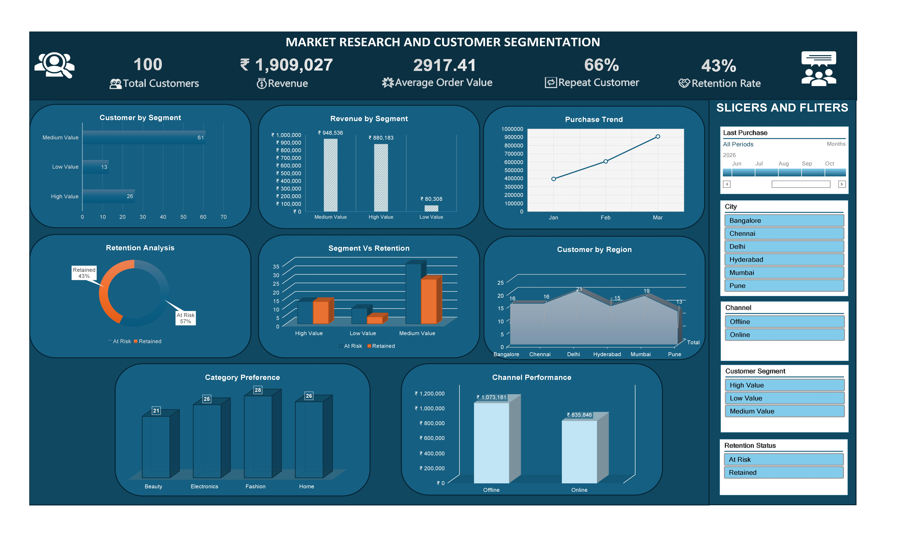

# market-research-and-customer-segmentation-excel
An interactive Advanced Excel dashboard for market research and customer segmentation using pivot tables, KPIs, and data-driven insights.
🚀 Project Overview

This project is a fully interactive Market Research & Customer Segmentation Dashboard built using Advanced Excel. It simulates a real-world business scenario where customer data is analyzed to generate actionable insights for marketing and strategic decision-making.

The dashboard combines data analysis, customer segmentation, KPI tracking, and retention insights into a single, user-friendly interface.

🎯 Business Objective

Analyze customer behavior and purchasing patterns
Segment customers based on value and engagement
Identify high-value and at-risk customers
Track key performance indicators (KPIs)
Enable data-driven business decisions
🛠 Tools & Skills Used
Microsoft Excel (Advanced)
Pivot Tables & Pivot Charts
Data Validation
Conditional Formatting
KPI Calculations
Customer Segmentation (Scoring Model)
Retention Analysis
Slicers & Timeline (Interactive Filters)

Dashboard Design
📂 Dataset Description
The dataset includes 100+ customer records with key attributes such as:
Customer ID, Age, Gender
City / Region
Income & Occupation
Purchase Frequency
Average Order Value (AOV)
Total Spending
Product Category
Purchase Channel (Online / Offline)
Engagement Level
Discount Sensitivity
Last Purchase Date

⚙️ Methodology
1. Data Preparation
Cleaned and structured raw data
Applied data validation to ensure accuracy
Standardized categorical variables

3. Customer Segmentation
Customers were segmented using a scoring model based on:
Spending behavior
Purchase frequency
Engagement level

Segments Created:
High Value Customers
Medium Value Customers
Low Value Customers
3. Retention Analysis

Customers were classified based on recency of purchase:
Retained Customers
At Risk Customers

4. KPI Development
The following KPIs were created:
Total Customers
Total Revenue
Average Order Value (AOV)
High-Value Customers Count
Repeat Customer Percentage
Retention Rate
Segment-wise Revenue

6. Data Analysis
Using Pivot Tables, the following insights were derived:
Customer distribution by segment
Revenue contribution by segment
Product category preference
Channel performance (Online vs Offline)
Region-wise customer distribution
Segment vs Retention analysis

📊 Dashboard Features
KPI Cards for quick performance overview
Customer Segmentation Analysis
Revenue Distribution by Segment
Retention Insights (Retained vs At Risk)
Product Category Preference Analysis
Channel Performance Analysis
Interactive Slicers (Segment, City, Channel, Retention)
Timeline Filter (Date-based analysis)

🖼 Dashboard Preview

📈 Key Insights
High-value customers contribute the majority of total revenue
Online channels outperform offline sales
Certain product categories dominate customer preferences
A portion of customers are at risk, indicating retention opportunities
Repeat customers form a significant share of the customer base

📁 Project Structure
📁 market-research-customer-segmentation-excel
 ┣ 📄 Market Research and Customer Segmentation.xlsx
 ┣ 📄 Raw Set.xlsx
 ┣ 📄 README.md
 ┗ 📄 dashboard.jpg

 💼 Business Impact

This project demonstrates how Excel can be used to:

Improve customer targeting strategies
Enhance retention and engagement
Support data-driven marketing decisions
Transform raw data into meaningful business insights
